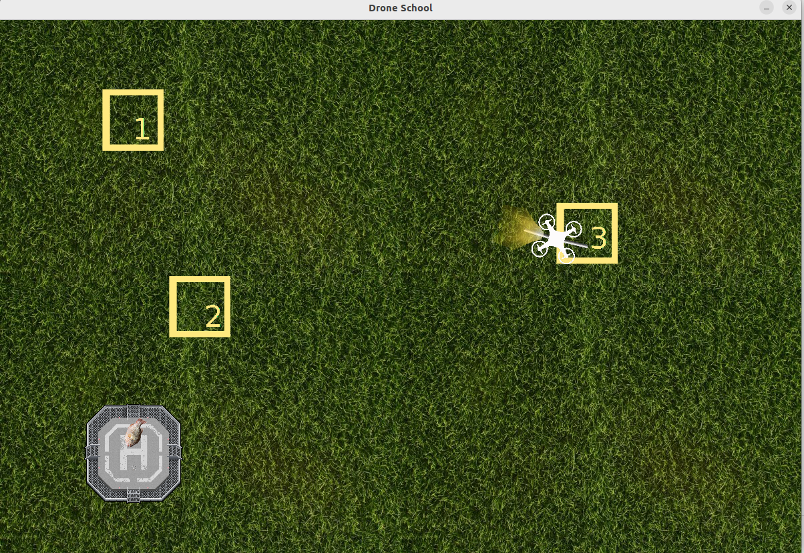
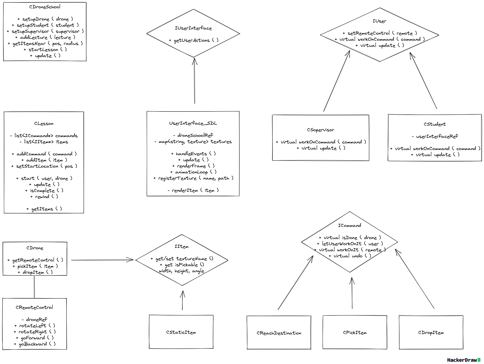

# Drone School SDL Project



## Getting started
The Drone School is example semestral project which was made for my classes of PA2. In drone school is superviser and student. The superviser is scripted and students is the user. In drone school a lesson can be created. A lesson consist of desciption of scene. There are spots, items and sequence of commands. First superviser shows how the lesson should be completed, then user should do the same. 
Project is designed to show some chosen design patterns and technique. There is builder pattern, command pattern, polymorphism. It also demonstrates ownership of pointer. Though SDL is used in the project, but it is covered by abstract user interface, so there are only couple of modules dependent on SDL. There is automated testing system, which run on commit (currently gitlab only). Documentation can be generated via doxygen. 
Superviser and Student are polymorphic, they do the lesson through the same method and acting diferrently on each command. All commands are polymorhic as well. User interface is abstract class. SDL is just one realization of userinterface, so it can be replaced by any other user intraface.


#### Setup For Build
This project requires `libsdl2-dev` and `libsdl2-image-dev`. Check the installation for your machine https://wiki.libsdl.org/SDL2/Installation. 

On Debian based system you can use those commands.

```sh
# Install SDL2 Library
sudo apt install libsdl2-dev 

# Install SDL2 Image to support image loaders
sudo apt install libsdl2-image-dev 

```

Compile the project
```sh
    make all
```

Start the project
```sh
    make run
```

Run all unit tests
```sh
    make test_all
```

Delete all generated files
```sh
    make clean
```

Run clang-tidy
```sh
    make lint
```

Generate documentation
```sh
    doxygen
```




## Things to improve

Use `std::unique_ptr` instead for `std::shared_ptr`.
